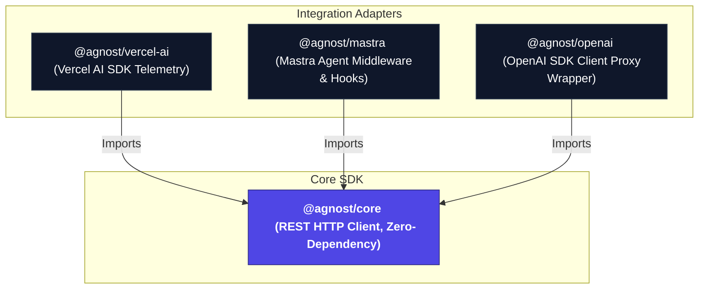

# 🌌 Agnost AI Integrations Workspace

[](https://pnpm.io/)
[](https://www.typescriptlang.org/)
[](#)

A monorepo containing production-ready, high-performance integration adapters for **Agnost AI** — the telemetry and session observability platform for AI agents and LLM applications.

These adapters allow you to plug Agnost AI observability into your working agent application in under **5 minutes**, capturing user intent, tool executions, latencies, token usage, and event trees seamlessly.

---

## 🏗️ Architecture Overview

The repository is built as a highly optimized `pnpm workspace` to enforce modularity, isolate dependencies, and avoid dependency leakage (phantom dependencies) that could bloat production applications.



### Workspace Packages

| Package | Purpose | Peer Dependencies |
| :--- | :--- | :--- |
| [**`@agnost/core`**](./packages/core) | Zero-dependency REST client for Agnost API (`/capture-session` & `/capture-event`) | None |
| [**`@agnost/vercel-ai`**](./packages/vercel) | Core telemetry integration for the Vercel AI SDK | `ai` >= 3.0.0 |
| [**`@agnost/mastra`**](./packages/mastra) | Observability middleware and hooks for the Mastra agent framework | `@mastra/core` >= 0.1.0 |
| [**`@agnost/openai`**](./packages/openai) | Proxy-based interceptor for the official OpenAI SDK client | `openai` >= 4.0.0 |

---

## ⚡ Quick Start & Usage

### 1. `@agnost/core`
The base HTTP client, built to run seamlessly in any JavaScript runtime (Node.js 18+, Vercel Edge, Cloudflare Workers, Deno, Bun).

```typescript
import { AgnostClient } from "@agnost/core";

const agnost = new AgnostClient({
  orgId: "your-org-uuid", // Get this from app.agnost.ai/settings
  debug: true,            // Prints detailed network logs (disable in production)
});

// 1. Capture a session (runs once per conversation, deduplicated locally)
await agnost.captureSession({
  sessionId: "conv-1234",
  userId: "user-999",
  email: "developer@example.com",
});

// 2. Capture a prompt (agent turn)
const parentEventId = await agnost.capturePrompt({
  sessionId: "conv-1234",
  promptName: "weather-agent-turn",
  input: "What's the weather in Seattle?",
  output: "It's currently rainy and 12°C in Seattle.",
  success: true,
  latencyMs: 850,
});

// 3. Capture an associated tool execution (linked to the parent turn)
await agnost.captureToolCall({
  sessionId: "conv-1234",
  toolName: "get_weather",
  args: { location: "Seattle" },
  result: { temp: 12, condition: "rainy" },
  success: true,
  latencyMs: 120,
  parentEventId, // Links the tool execution to the main prompt in your dashboard tree
});
```

---

### 2. `@agnost/vercel-ai`
Adapts seamlessly to Vercel AI SDK's lifecycle hooks using `experimental_telemetry.integrations`. It captures input arguments on start, traces step executions, logs tool outputs, and profiles latency.

```typescript
import { openai } from "@ai-sdk/openai";
import { generateText } from "ai";
import { AgnostTelemetry } from "@agnost/vercel-ai";

const agnost = new AgnostTelemetry({
  orgId: process.env.AGNOST_ORG_ID!,
});

const result = await generateText({
  model: openai("gpt-4o"),
  prompt: "Write a short poem about recursion.",
  experimental_telemetry: {
    isEnabled: true,
    integrations: [agnost],
    metadata: {
      sessionId: "session-456",
      userId: "user-111",
    },
  },
});
```

> [!NOTE]
> `experimental_telemetry` handles all errors internally, ensuring that if an observability request fails, your core agent pipeline does **not** crash.

---

### 3. `@agnost/mastra`
Integrates cleanly with the Mastra agent framework. Provides a HTTP Middleware for Hono/Mastra servers to inject context automatically, and agent hook parameters to map runtime executions.

```typescript
import { createAgnostMiddleware, agnostHooks } from "@agnost/mastra";
import { AgnostClient } from "@agnost/core";
import { Agent } from "@mastra/core";

const agnostClient = new AgnostClient({ orgId: "your-org-uuid" });

// 1. Create Hono Middleware for automatic session context propagation
export const agnostMiddleware = createAgnostMiddleware({ orgId: "your-org-uuid" });

// 2. Attach hooks to your Agent instance
export const weatherAgent = new Agent({
  name: "weather-agent",
  instructions: "You are a weather agent.",
  model: { provider: "OPEN_AI", name: "gpt-4o" },
  hooks: agnostHooks(agnostClient), // Hooks capture prompts and tools under the active session
});
```

---

### 4. `@agnost/openai`
Since the official OpenAI SDK does not have telemetry hooks, we wrap it in a lightweight JavaScript Proxy. It recursively intercepts `chat.completions.create` calls, giving you full telemetry with **zero code changes at call sites**.

```typescript
import OpenAI from "openai";
import { withAgnost } from "@agnost/openai";

// Wrap your client in one line
const openai = withAgnost(
  new OpenAI({ apiKey: process.env.OPENAI_API_KEY }),
  {
    orgId: process.env.AGNOST_ORG_ID!,
    // Context is read dynamically per execution (perfect for web servers!)
    getContext: () => ({
      sessionId: "current-http-session-id",
      userId: "user-007",
    }),
  }
);

// Call it exactly as you did before — types are 100% preserved
const response = await openai.chat.completions.create({
  model: "gpt-4o",
  messages: [{ role: "user", content: "Tell me a joke." }],
});
```

---

## 🛠️ Development & Workspace Commands

Ensure you have [pnpm](https://pnpm.io/) installed globally.

### 1. Install Dependencies
Installs all dependencies across all workspace packages and links them locally.
```bash
pnpm install
```

### 2. Build All Packages
Transpiles TypeScript to CJS, ESM, and generates `.d.ts` declaration maps inside the `dist/` folder of each package.
```bash
pnpm build:all
```

### 3. Run Type Checking
Runs TypeScript compiler diagnostics across all packages.
```bash
pnpm typecheck
```

### 4. Run Test Suite
Runs the test suite across all modules.
```bash
pnpm test
```

### 5. Run End-to-End Tests
We have built an E2E test harness (`tests/e2e.ts`) and a high-performance local Mock API Server (`tests/mockserver.ts`) that matches the Agnost API contract. This allows full validation offline:

```bash
# Terminal 1: Spin up the local mock server
pnpm --filter agnost-integrations exec tsx tests/mockserver.ts

# Terminal 2: Run tests pointing to mock server
$env:AGNOST_ORG_ID="test"
$env:AGNOST_BASE_URL="http://localhost:3099"
pnpm --filter agnost-integrations exec tsx tests/e2e.ts
```

---

## 💎 Design Highlights

- **Edge Compatibility**: Uses standard `fetch()` instead of heavy server-only OpenTelemetry SDKs, making it compatible with edge runtime environments.
- **Robust Error Handling**: Never propagates API or network ingestion failures to your agent runtime.
- **Precision Event Trees**: Uses client-side UUID coordination to map prompt outputs and nested tool executions into precise parent-child trees in the Agnost dashboard.
- **Zero Hoisting Issues**: The workspace layout enforces strict package boundaries so you never run into bundle-time circular imports.
