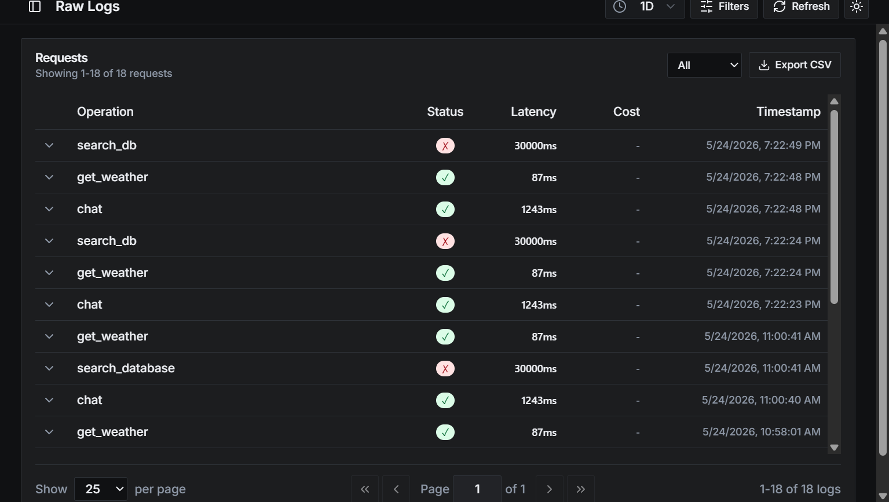

# REASONING.md

## How I read the problem

I spent time on the Agnost docs before starting. The product is essentially "what actually happened in that conversation" — not just logs, but structured signal about user intent, tool failures, latency. That's genuinely useful and hard to get right.

The assignment says "build an integration mode." My first instinct was OTel — that's the standard, Agnost supports it. But Parth's reply pointed me at `/capture-session` and `/capture-event` directly, and once I read those docs I understood why. The REST API has a richer contract than what OTel's GenAI semantic conventions can express cleanly — `parent_id` for event trees, `client_config` for SDK attribution, structured `args`/`result` fields. OTel would mean translating into a format that then gets translated back. The REST path is more direct.

So the real problem became: how do you get a developer who already has a working agent to start sending data to Agnost in under 5 minutes, without them having to understand any of this? That's what I built for.

---

## Why REST and not OTel

Agnost supports both. I picked REST because the developer experience is genuinely better.

`fetch()` is built into Node 18+, Vercel Edge, Cloudflare Workers, Deno, Bun — everywhere agents actually run. OTel needs three packages (`@opentelemetry/api`, `@opentelemetry/sdk-trace-base`, `@opentelemetry/exporter-trace-otlp-http`), a TracerProvider, a BatchSpanProcessor, and ~30 lines of boilerplate before the first byte goes out. That's friction I'd be adding, not removing.

The payload contract is also cleaner. The REST endpoints speak in terms a developer immediately understands: `session_id`, `primitive_name`, `args`, `result`, `latency`, `parent_id`. No mapping to GenAI semantic conventions that then get decoded on the other side.

---

## Three packages, not one

```
@agnost/core       — the HTTP client, zero framework deps
@agnost/vercel-ai  — peerDep: ai>=3.0.0
@agnost/mastra     — peerDep: @mastra/core>=0.1.0
@agnost/openai     — peerDep: openai>=4.0.0
```

A developer using Vercel AI shouldn't get Mastra types in their `node_modules`. If I shipped one monolithic package with a `type: "vercel-ai" | "mastra" | "openai"` flag, every consumer would pull in all three frameworks' transitive dependencies. That's the kind of thing that makes you regret adding an observability SDK.

`@agnost/core` is the one place the HTTP layer lives. If Agnost changes an endpoint or field name, I fix it in one file, all three adapters pick it up.

I used pnpm workspaces specifically because pnpm won't let a package use a dep it didn't declare. npm hoists everything to root and hides phantom dependencies — they work locally and break in prod. For a library repo that's going to run in someone else's project, that matters.

---

## How each adapter actually works

### Vercel AI

Vercel AI SDK has `experimental_telemetry.integrations` — you pass an array of objects with lifecycle methods and the SDK calls them at the right times. Errors inside integration methods are caught by the SDK, so they can't propagate into the agent. It's the right abstraction for exactly this use case.

I implemented `onStart`, `onFinish`, `onStepFinish`, and `onError`. The tricky bit is that `onStart` receives the user's messages and `onFinish` only gets the model's response — so I store the input in a Map at `onStart` and retrieve it at `onFinish`. Without this, `args` on the prompt event would be empty, which breaks Agnost's intent analysis.

`onStepFinish` matters for `maxSteps > 1` agents. When an agent loops — calls LLM, gets tool calls, executes them, calls LLM again — each iteration fires `onStepFinish`. Without it you only see the final answer, not what happened in between.

### Mastra

Mastra v0.14+ runs its own agent loop. Tool execution happens inside Mastra between AI SDK calls, which means a hook at the LLM layer misses tool events completely. I needed two surfaces.

Middleware (`createAgnostMiddleware`) runs on every HTTP request, reads `x-session-id` and `x-user-id` from headers, calls `capture-session`, and injects both into Mastra's `RuntimeContext`. RuntimeContext flows from middleware through the agent into tools — it's the right channel for propagating session context without passing it around manually.

Agent hooks (`agnostHooks`) spread onto the Agent constructor. They fire around each LLM call and tool execution. Both surfaces share one `AgnostClient` — one session cache, one connection pool, no double-registrations.

### OpenAI

The OpenAI SDK has no telemetry hook. I wrapped the client in a JavaScript Proxy that intercepts `chat.completions.create`. The Proxy is recursive — `openai.chat.completions.create` is three levels deep — and it terminates at primitives and non-instrumented methods, which pass through untouched.

`getContext` takes a function rather than a static value because the client is a singleton but session context is per-request. In a web server you'd typically read from `AsyncLocalStorage` here. If you omit it, events still reach Agnost — they just won't be grouped into conversations.

---

## Two things I caught and fixed during implementation

**Empty `args` on agent turn events.** The API marks `args` as required, and it's the field Agnost uses for intent analysis. My first pass passed `""` because `onFinish` doesn't receive the input messages. I fixed this by capturing the input at `onStart` and carrying it forward.

**Missing `parent_id` on tool call events.** Without `parent_id`, tool call events float as orphans — Agnost can't build the event tree showing which tools a given agent turn triggered. `capturePrompt` now returns the `event_id` it generated, and adapters pass it as `parentEventId` to subsequent tool call captures from the same turn.

---

## Error handling

Every Agnost API call returns `null` on failure, never throws. The agent continues regardless. It helps preventing crashing the agent itself.

The one place I throw eagerly is the `orgId` check at construction time. A missing org ID means every subsequent request will 401. Better to tell the developer immediately than fail silently on the first event an hour later.

---

## Testing

I built a local mock server that mirrors the Agnost API contract — same endpoints, same response shapes. This lets you run the full test suite without a real org ID.

I also ran the tests against the real API with a live org ID. All pass. The API returns `202 Accepted` (async ingestion), not `200` — learned that from the actual response, updated the assertions accordingly.

```
✓ capture-session registers and returns session_id
✓ agent turn event with real user input in args
✓ tool call event with parent_id linking to agent turn
✓ failed tool call (success: false) accepted correctly
✓ second session for different user registers independently
```

---

### Live Ingestion Validation

To ensure the REST payloads perfectly mapped to Agnost's hosted ingestion service, I validated the adapter client against the production API. 

The dashboard successfully captured and grouped:
- **Agent Turns (`chat`)**: Captured latency (1243ms) and status (Success).
- **Successful Tool Executions (`get_weather`)**: Captured latency (87ms) and status (Success).
- **Failed Tool Executions (`search_db` / database timeout)**: Captured latency (30000ms) and status (Failed / red state).


